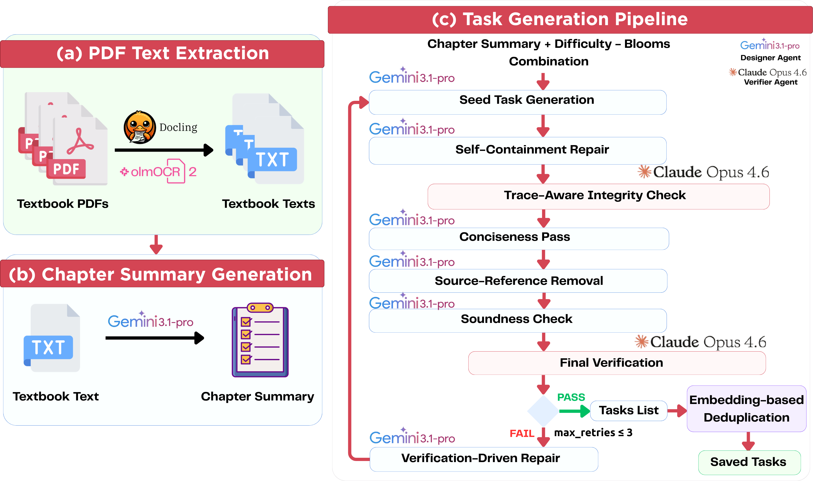

# FLAME Framework

We introduce **F**ine-grained, **LA**rge-scale **M**odel **E**valuation (FLAME), a framework for automated, comprehensive benchmark generation grounded in external knowledge sources such as textbooks and technical references



## Repository Layout

```text
src/
  cfg/task_generation/
    agent_config.yaml       # Model/provider and deduplication settings
    pipeline_config.yaml    # Corpus, output, resume, and loop settings
  schemas/                  # Lightweight task-generation schemas and I/O
  task_generation/
    runner.py               # Main CLI entrypoint
    agentic_pipeline.py     # Generation, repair, verification loop
    designer_agent.py       # Designer model wrapper
    verifier_agent.py       # Verifier model wrapper
    prompts.py              # Prompt templates
    blueprints/
      blueprints.json       # Difficulty and Bloom's-level combinations
    sample_chapter_text_files/
      *.txt                 # Example chapter corpus
  utils/
    model_client_utils.py   # Model client construction and retry helpers
```

## Requirements

- Python 3.10 or newer
- Runtime dependencies from `pyproject.toml`
- API credentials for the providers configured in
  `src/cfg/task_generation/agent_config.yaml`

Common environment variables are:

```text
GOOGLE_API_KEY
ANTHROPIC_API_KEY
OPENAI_API_KEY
```

`OPENAI_API_KEY` is only required when deduplication is enabled.

## Configuration

Pipeline behavior is controlled by:

```text
src/cfg/task_generation/pipeline_config.yaml
```

Important fields:

- `experiment_id`: output experiment folder name
- `output_base_dir`: root directory for generated artifacts
- `book_chapter_dir`: chapter corpus directory under `src/task_generation/`
- `blueprints_file`: blueprint JSON file under `src/task_generation/blueprints/`
- `max_retries`: retry budget for failed candidates
- `num_tasks_per_combo`: fallback task count when a blueprint omits `num_tasks`
- `checkpoint`: incremental save and resume settings

Model behavior is controlled by:

```text
src/cfg/task_generation/agent_config.yaml
```

This file configures the designer model, verifier model, and optional
embedding-based deduplication.

Task difficulty and Bloom's-level coverage are controlled by:

```text
src/task_generation/blueprints/blueprints.json
```

Each blueprint combination can define:

- `difficulty`
- `blooms_level`
- `num_tasks`

## Run

From the repository root:

```bash
python3 -m src.task_generation.runner
```

The runner creates a fresh task tag automatically.

## Resume Or Reuse A Task Tag

Pass an existing or desired task generation task tag:

```bash
python3 -m src.task_generation.runner --tasks-tag _YYYYMMDD_HHMMSS
```

When resuming, the runner skips generation units whose `tasks.json` output
already exists and can also resume from per-combination checkpoints when
checkpointing is enabled.

## Parallel Run

Use the helper script:

```bash
bash src/task_generation/run_parallel_task_gen.sh ''
```

The first argument is an optional task tag. Leave it empty to create a fresh tag.

You can control the number of workers with `WORKER_COUNT`:

```bash
WORKER_COUNT=4 bash src/task_generation/run_parallel_task_gen.sh ''
```

Equivalent direct worker commands:

```bash
python3 -m src.task_generation.runner --tasks-tag _YYYYMMDD_HHMMSS --worker-index 0 --worker-count 4
python3 -m src.task_generation.runner --tasks-tag _YYYYMMDD_HHMMSS --worker-index 1 --worker-count 4
python3 -m src.task_generation.runner --tasks-tag _YYYYMMDD_HHMMSS --worker-index 2 --worker-count 4
python3 -m src.task_generation.runner --tasks-tag _YYYYMMDD_HHMMSS --worker-index 3 --worker-count 4
```

## Outputs

Generated tasks are written to:

```text
<output_base_dir>/<experiment_id>/tasks/<tasks_tag>/<area_id>/<capability_id>/tasks.json
```

Each generation-unit directory may also contain:

```text
chapter_summary.json
verification_stats.json
token_stats.json
dedup_report.json
discarded_tasks.json
embedding_cache.json
checkpoints/
```

Example `tasks.json`:

```json
{
  "metadata": {
    "experiment_id": "test_exp",
    "output_base_dir": "base_output",
    "timestamp": "2026-05-04T20:00:00Z",
    "input_stage_tag": "chapter_placeholders",
    "output_stage_tag": "_20260504_200000",
    "resume": false
  },
  "tasks": [
    {
      "task_id": "task_chapter_001_000001",
      "task_statement": "A binary classifier is evaluated on an imbalanced dataset. Which metric best captures the fraction of true positive examples that were predicted positive?",
      "task_type": "multiple_choice",
      "solution_type": "multiple_choice",
      "difficulty": "medium",
      "bloom_level": "Apply",
      "choices": [
        { "label": "A", "solution": "Accuracy" },
        { "label": "B", "solution": "Precision" },
        { "label": "C", "solution": "Recall" },
        { "label": "D", "solution": "F1 score" },
        { "label": "E", "solution": "None of the above" }
      ],
      "capability_id": "cap_ch_chapter_001_00000000",
      "capability_name": "placeholder_capability_chapter_001",
      "area_id": "area_ch_chapter_001_00000000",
      "area_name": "placeholder_area_chapter_001",
      "domain_id": "domain_000",
      "domain_name": "evaluation",
      "generation_metadata": {
        "correct_answer": "C",
        "source_chapter_id": "chapter_001",
        "capability_source_mode": "chapter_placeholder",
        "solution_graph": {
          "nodes": [
            {
              "id": "V1",
              "content": "Recall is defined as the fraction of true positive examples that are predicted positive."
            },
            {
              "id": "V2",
              "content": "The task asks for the metric matching that definition."
            }
          ],
          "edges": [
            {
              "from": "V1",
              "to": "V2",
              "operation": "Match the metric definition to the requested quantity."
            }
          ]
        },
        "solution_steps": [
          "Identify the quantity in the question: true positive examples predicted positive.",
          "Compare that quantity with the metric definitions.",
          "Select recall because it uses true positives divided by all actual positives."
        ],
        "complete_solution": "Recall measures the fraction of actual positive examples that were predicted positive, so the correct answer is C."
      }
    }
  ]
}
```

Example `verification_stats.json`:

```json
{
  "chapter_id": "chapter_001",
  "chapter_relpath": "chapter_001.txt",
  "book_name": "root_corpus",
  "capability_id": "cap_ch_chapter_001_00000000",
  "area_id": "area_ch_chapter_001_00000000",
  "num_verifier_calls": 1,
  "verification_logs": [
    {
      "task_batch_id": "chapter_001_medium_Apply",
      "attempt_index": 0,
      "attempt_human": "1/4",
      "blueprint_key": "medium_Apply",
      "difficulty": "medium",
      "blooms_level": "Apply",
      "candidate_label": "SeedGeneration 1/4 SeedCandidate",
      "verification_report": {
        "json_format_valid": "Yes",
        "mcq_integrity": "Yes",
        "blooms_alignment": "Yes",
        "constraint_compliance": "Yes",
        "overall_verdict": "Pass",
        "explanation": "The candidate is valid, self-contained, and aligned with the requested Bloom's level."
      }
    }
  ]
}
```

## Placeholder Metadata

The runner creates schema-compatible placeholder metadata directly from each
chapter file. For every chapter, it builds:

- a `Domain` from the blueprint domain,
- an `Area` with a deterministic chapter-derived `area_id`,
- a `Capability` with a deterministic chapter-derived `capability_id`.

These placeholder objects satisfy the same schema chain used by generated task
artifacts:

```text
Domain -> Area -> Capability -> Task
```

Later on, the capability and areas can be included manually.

## Notes

- Keep source text files under the configured `book_chapter_dir`.
- Keep blueprint counts small for smoke tests.
- Disable `dedup.enabled` in `agent_config.yaml` if you want to test generation
  without embedding calls.
